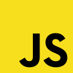
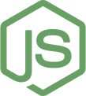
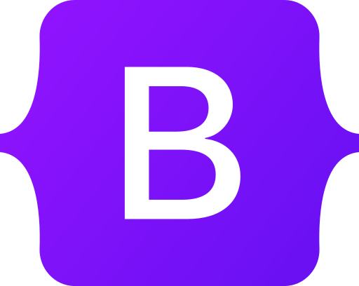

### Hi there 👋 I am Junior Full Stack Developer working in Berlin, Germany.

  
  

#### Now

- :man_student: Finishing my first Full Stack Developer Coding Bootcamp.
- :fire: Interested in Front / Back and Full Stack Development;
- :calendar: Looking for contributing to JavaScript open source projects 

#### Bio

- 🏢 I'm currently working at **Zalando SE**
- ⚙️ I use daily: `.js`, `.html`, `.css`, `.json`
- 🌱 Learning all about **Full Stack Development**
- 💬 Ping me about **JavaScript**, **React**, **Node**, **HTML**, **CSS**
- 📫 Reach me: [linkedin.com/in/mikolaj-renke](https://linkedin.com/in/mikolaj-renke/)

#### My Current Stack

    
   
   
   
   
   
   
  

